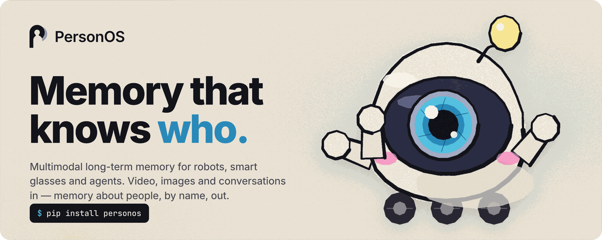
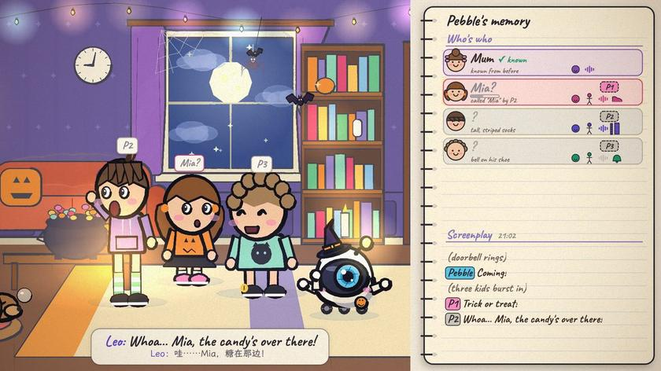
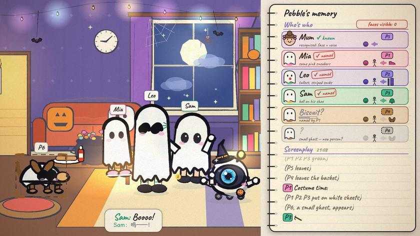
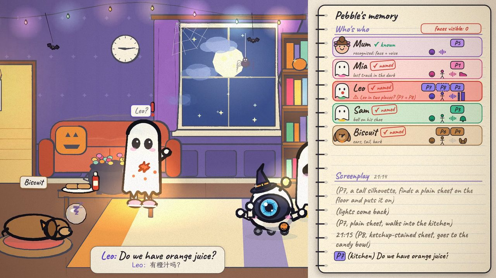
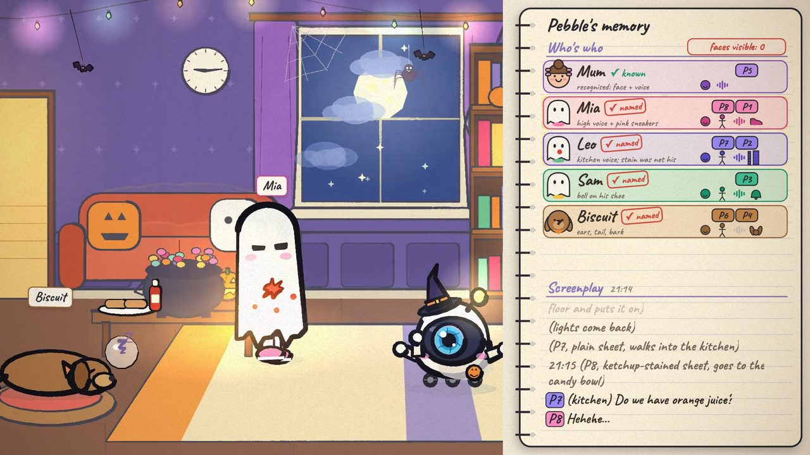
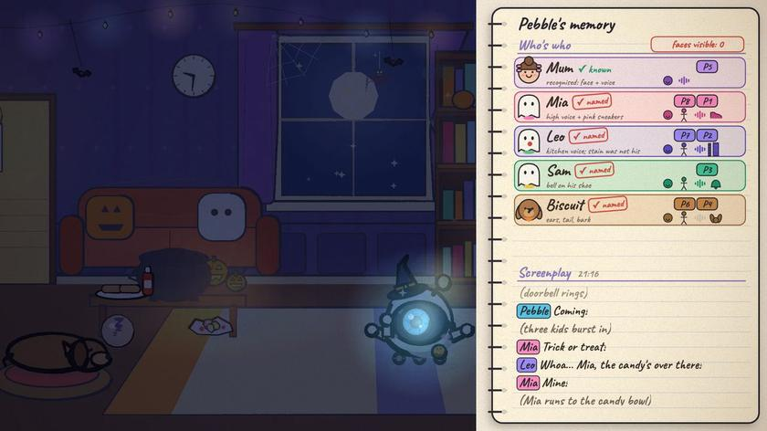
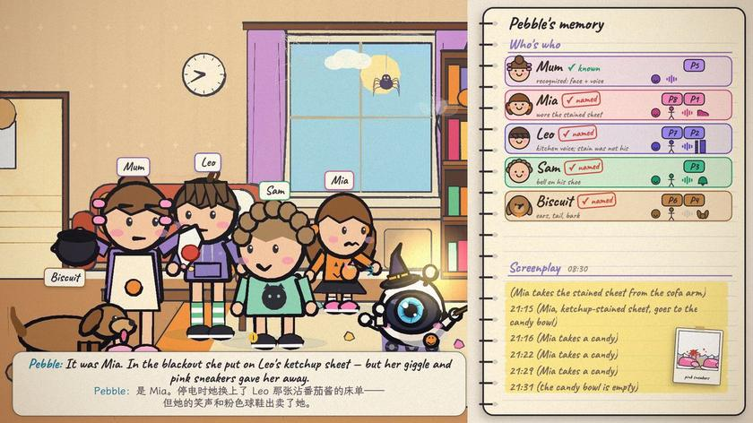
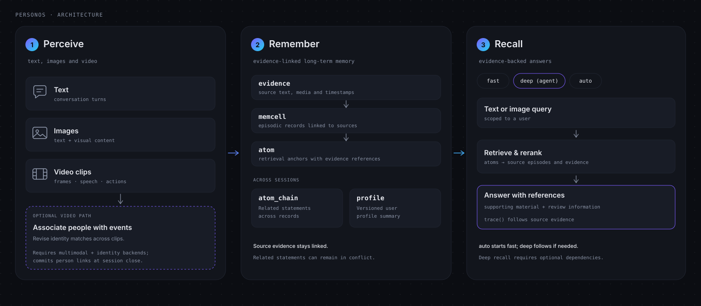

<p align="center">
  
</p>

<h1 align="center">PersonOS</h1>

<p align="center"><strong>Multimodal long-term memory that knows who</strong></p>

<p align="center">
  <a href="https://pypi.org/project/personos/"></a>
  <a href="https://pypi.org/project/personos/"></a>
  <a href="LICENSE"></a>
  <a href="#evaluation"></a>
  <a href="#evaluation"></a>
</p>

<p align="center">
  English · <a href="README.zh-CN.md">简体中文</a>
</p>

<p align="center">
  <a href="#demo">Demo</a> ·
  <a href="#introduction">Introduction</a> ·
  <a href="#key-features">Key Features</a> ·
  <a href="#quick-start">Quick Start</a> ·
  <a href="#evaluation">Evaluation</a> ·
  <a href="#progress">Progress</a>
</p>

PersonOS is a long-term memory framework for devices that see and hear: home robots, smart glasses, desktop agents.
It takes multimodal input — video, images and conversations — records what happened, works out **who** said and did what, and returns answers together with the evidence behind them.

## Demo

https://github.com/user-attachments/assets/2faea78b-7db6-4a7a-8f6d-22c7cd4a7a38

**Who ate the Halloween candy?** Pebble, a small home robot, watches three kids arrive for trick-or-treat. At first it doesn't know
any of them. Over the evening it learns their names from how they talk to each other, keeps telling them apart after they put on identical
bedsheets, and catches the moment Mia swaps sheets during a blackout to pin the candy theft on Leo.

The notebook on the right is Pebble's memory, and it works the way PersonOS does. The **episodic screenplay** is written the moment things
happen, using temporary person codes (`P1`, `P2`…). Pebble keeps **who's who** in a separate character table. As stronger evidence comes in
from the people it observes (a clearer face, a voice, and so on), it revises its identity guesses, and only when the night's memory is saved are the names written back into the screenplay.
Next morning, when everyone suspects Leo, Pebble steps in and sets the record straight.

<table>
  <tr>
    <td width="33%"></td>
    <td width="33%"></td>
    <td width="33%"></td>
  </tr>
  <tr>
    <td><b>Zero-shot: identities learned from natural conversation.</b> One line — "Whoa… Mia, the candy's over there!" — turns stranger <code>P1</code> into <i>Mia?</i></td>
    <td><b>Multi-cue identification.</b> Recognition doesn't rest on face and voice alone. Spatio-temporal continuity, build and gait all count, so every ghost is still identified correctly once the faces are covered.</td>
    <td><b>Physical consistency check.</b> Nobody can be in two places at once. When the ketchup-stained ghost looks like Leo but Leo's voice is coming from the kitchen, one of them has to be wrong.</td>
  </tr>
  <tr>
    <td></td>
    <td></td>
    <td></td>
  </tr>
  <tr>
    <td><b>…and the identity gets corrected.</b> Identities are revisable. A giggle and a pair of pink sneakers give the ghost away as Mia, so its temporary code is reassigned to Mia's character card. The episodic record already written is left untouched; only what the temporary code points to changes.</td>
    <td><b>Identities and the final screenplay are settled last.</b> When capture ends and the memory is saved, every temporary code in the episodic screenplay is replaced with a real name, leaving one complete record.</td>
    <td><b>Every answer comes with traceable evidence.</b> All answers are backed by episodic memory. When Mum demands "who ate the candy?", Pebble doesn't just say Mia — it attaches the exact lines from the screenplay and the photo of those sneakers as evidence.</td>
  </tr>
</table>

## Introduction

Most multimodal memory systems stop at understanding; they don't identify people. PersonOS adds identity on top: zero-shot person identification and episodic memory, with no enrollment step.

<picture>
  <source media="(prefers-color-scheme: light)" srcset="docs/assets/architecture-light.svg">
  
</picture>

**1. Perceive.** A multimodal model watches each video clip in turn and writes an episodic screenplay: who said what, what happened, and what the surroundings were like.

**2. Resolve identity.** People in the video are matched against known characters by face, voice, build and continuity. Meanwhile, character chains keep collecting and updating evidence (a first sighting, a clearer face,
a cleaner voice sample, a name called out loud). When the session closes, temporary identities are adjudicated and promoted to persistent characters.

**3. Remember.** Once identities are resolved, the screenplay is written into a layered, append-only memory:

```
evidence  ──►  memcell (episode)  ──►  atom          ──►  atom_chain
raw input      the narrative unit      atomic memory,     the same fact over time,
never edited   consulted at answer     retrieval anchor   kept as a group
               time
```

**4. Recall.** Locate the answer and its evidence in the layered memory, assemble them, and answer.

## Key Features

- **Zero-shot person identification.** No enrollment step. Learn who is who from natural conversation and observation.
- **Multiple cues, revisable identities.** Combine face, voice, build and spatio-temporal continuity; revise what a temporary identity points to when stronger evidence arrives.
- **Multimodal episodic memory.** Take in video, images and conversations, write what happened into layered memory, and connect episodes to people.
- **Answers with evidence.** Return the relevant episodes and original evidence alongside each answer, so it can be traced back to what happened.

A multimodal memory system that understands video but not people records this:

```diff
- [21:15] A ghost in a ketchup-stained sheet went to the candy bowl.
- [21:16] A ghost took a candy.
- [21:22] A ghost took a candy.
- [21:29] A ghost took a candy.
```

Because it never knew who was who or who did what, it can never answer "who ate the candy?" correctly. PersonOS records this instead:

```diff
+ [21:15] Mia, wearing Leo's ketchup-stained sheet, went to the candy bowl.
+ [21:16] Mia took a candy.
+ [21:22] Mia took a candy.
+ [21:29] Mia took a candy.
```

Every episodic memory points at a stable person. That is what lets an agent built on PersonOS go from seeing, to understanding, to actually knowing what happened.

## Quick Start

### Text memory

```bash
pip install personos
export PERSONOS_LLM_API_KEY=sk-...
export PERSONOS_LLM_BASE_URL=https://api.openai.com/v1   # any OpenAI-compatible endpoint
```

```python
from personos import Memory

m = Memory()   # SQLite under ~/.personos, nothing to install

m.add("I moved from Hangzhou to Shanghai in June", user_id="alice", session_id="s1")
m.end_session(user_id="alice", session_id="s1", sync=True)

print(m.search("where do I live?", user_id="alice").ans.answer)
# -> Shanghai
```

### Video memory

Video understanding needs a multimodal model configured as well:

```bash
pip install 'personos[identity]'
export PERSONOS_VIDEO_BACKEND=real
export PERSONOS_MLLM_API_KEY=sk-...  PERSONOS_MLLM_MODEL=...   # any model that accepts video
```

```python
for clip in ["clip000.mp4", "clip001.mp4", "clip002.mp4"]:          # consecutive clips
    m.add([{"role": "user", "content": "", "video": clip}],
          user_id="robot", session_id="living-room")

m.end_session(user_id="robot", session_id="living-room", sync=True)  # identities are committed here

out = m.search("What's the name of the girl at the table, and what does she study?", user_id="robot")
print(out.ans.answer)       # Alice ... math
print(out.ans.cited_cells)  # the episodes (and clips) the answer came from
```

Run `personos doctor` to see which features your current configuration supports. More examples in
[examples/](examples/README.md).

### Installation options and usage

Install only the extras you need:

| Install | What it adds |
|---|---|
| `pip install personos` | Text memory: layered writes, fast and deep recall, user profiles |
| `personos[deep]` | Multi-step deep-recall agent (recommended) |
| `personos[image]` | Image ingest and recall over photos |
| `personos[identity]` | Video with face / build / voiceprint identity (~2 GB) |
| `personos[mysql]` `personos[redis]` | Multi-process deployments |
| `personos[oss]` | Object storage instead of local media files |
| `personos[all]` | Everything |

<details>
<summary><b>Model weights</b></summary>

<br>

(Optional) models required for person identification:

| Capability | Weights | Location |
|---|---|---|
| Face recognition | InsightFace `buffalo_l` (~300 MB) | `~/.insightface` (auto-download) |
| Voiceprints | SpeechBrain `spkrec-ecapa-voxceleb` | HuggingFace cache; override with `PERSONOS_ECAPA_MODEL` / `PERSONOS_ECAPA_DIR` |
| Multimodal understanding | none, remote API | `PERSONOS_MLLM_*` points at any MLLM endpoint |

</details>

<details>
<summary><b>Configuration</b></summary>

<br>

Only the model endpoint is required. Everything else degrades gracefully.

| | Default | If unset |
|---|---|---|
| **Chat + embeddings** | — | **required** |
| Database | SQLite at `~/.personos` | set `PERSONOS_DB_URL` for MySQL (only needed with several workers) |
| Multimodal model | off | images are stored but not understood; video is refused with instructions |
| Media storage | local files | set `PERSONOS_MEDIA_BACKEND=oss` for object storage |
| Reranker | off | retrieval keeps its fusion order |
| Deep recall | off | `pip install personos[deep]` |
| Redis | off | single process; session state in memory |
| Tracing | off | every tracing call is a no-op |

The model service fetches video clips by URL, so with local media storage set `PERSONOS_MEDIA_BASE_URL`
to a publicly reachable prefix (or use OSS). Every option is listed in [.env.example](.env.example).

Calling a capability that isn't configured produces a warning like this:

```
MissingCapability: video understanding is unavailable: no multimodal model is configured
  To enable it: set PERSONOS_MLLM_API_KEY and PERSONOS_MLLM_MODEL
```

</details>

<details>
<summary><b>Core API</b></summary>

<br>

```python
m.add(messages, user_id=..., session_id=...)   # text, a dict with an image, or video clips
m.end_session(user_id=..., session_id=...)     # close the segment; build memories and commit identities
m.search(query, user_id=..., mode="auto")      # "auto" | "fast" | "deep"
m.profile(user_id=...)                         # distilled user profile
m.trace(node_id, user_id=...)                  # provenance, both directions
m.capabilities()                               # what this configuration can do
m.reset(user_id=...)                           # delete one user's data
```

Writes are asynchronous by default. `add()` and `end_session()` enqueue onto a per-session ordered queue (FIFO per session,
fair across sessions, backpressure when overloaded) and return an `AddReceipt` immediately. For a synchronous write,
pass `sync=True` or call `m.flush(...)`. When the queue is full, `QueueBusy` is raised; the HTTP API reports it as
`503 + Retry-After`.

Reads (`search`, `profile`, `trace`) are synchronous.

The recall result also includes the answer, resolved person, evidence and review:

```python
out = m.search("who ate the candy?", user_id="pebble")
out.ans.answer   # the answer
out.rw.subject   # who the question was resolved to be about
out.hits         # atoms retrieved, in fusion order
out.reviews      # the adjudicator's verdict on the draft
out.to_public()  # the same, as a plain dict
```

</details>

<details>
<summary><b>Running as a service</b></summary>

<br>

[`server/`](server/README.md) exposes PersonOS long-term memory as a network service.

</details>

## Evaluation

**[M3-Bench-robot](https://github.com/bytedance-seed/m3-agent)** — a multimodal memory benchmark shot from a robot's first-person view across everyday environments.

| | **Overall** | Person understanding | Multi-hop | Multi-evidence | Cross-modal | General knowledge |
|---|:---:|:---:|:---:|:---:|:---:|:---:|
| **PersonOS** | **61.5** | **73.5** | **63.5** | **62.8** | **59.0** | **48.0** |
| M3-Agent, same models | 37.4 | 50.9 | 42.4 | 37.1 | 37.0 | 28.4 |
| M3-Agent, as published | 30.7 | 43.3 | 29.4 | 32.8 | 31.2 | 19.1 |

**[Video-MME](https://github.com/BradyFU/Video-MME)** — long videos, no subtitles.

| **Overall** | Synopsis | Object recog. | Spatial reas. | Object reas. | Temporal reas. | Action recog. | Action reas. | Temporal perc. | Attribute perc. | OCR | Counting | Spatial perc. |
|:---:|:---:|:---:|:---:|:---:|:---:|:---:|:---:|:---:|:---:|:---:|:---:|:---:|
| **87.0** | 93.3 | 92.6 | 90.9 | 87.9 | 87.9 | 84.1 | 85.0 | 83.3 | 85.2 | 78.6 | 70.8 | 33.3 |

PersonOS holds up just as well on text benchmarks:

| Benchmark | Overall | Breakdown |
|---|:---:|---|
| [LoCoMo-10](https://github.com/snap-research/locomo) | **83.3** | single-hop 89.3 · temporal 79.8 · multi-hop 77.3 · open-domain 58.7 |
| [LongMemEval-S](https://github.com/xiaowu0162/LongMemEval) | **80.6** | knowledge-update 91.7 · single-session-assistant 98.2 · single-session-user 89.1 · multi-session 76.9 · temporal 76.4 · preference 43.3 · abstention 73.3 |

## Progress

- [x] Layered memory architecture
- [x] Multimodal memory: understanding and recall
- [x] Person identification
- [x] Async task processing, HTTP server
- [ ] Memory inspector UI: timeline, character gallery, episodic memory
- [ ] MCP server for Claude Code, Cursor and other MCP clients
- [ ] Streaming ingestion for live camera feeds
- [ ] Paper and the full video evaluation code

---

**Contributing**

Issues and PRs are welcome — see [CONTRIBUTING.md](CONTRIBUTING.md). Tests run with `pytest` and need no external services.

**Acknowledgements**

- The M3-Bench-robot benchmark comes from
  [M3-Agent / M3-Bench](https://github.com/bytedance-seed/m3-agent)
  (ByteDance-Seed, CC BY-NC-SA 4.0).

**License**

Apache-2.0. See [LICENSE](LICENSE).
