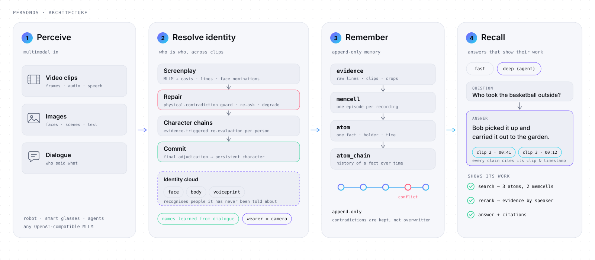

<p align="center">
  <a href="https://personos-ai.com/">
    <picture>
      <source media="(prefers-color-scheme: dark)" srcset="docs/assets/brand/wordmark-dark.svg">
      
    </picture>
  </a>
</p>

<p align="center"><strong>支持人物身份解析的多模态长期记忆框架</strong></p>

<p align="center">
  <a href="https://personos-ai.com/">官方网站</a> ·
  <a href="docs/usage.zh-CN.md">使用文档</a> ·
  <a href="#快速开始">快速开始</a> ·
  <a href="#案例演示">案例演示</a> ·
  <a href="docs/evaluation.zh-CN.md">评测</a> ·
  <a href="README.md">English</a>
</p>

<p align="center">
  <a href="https://pypi.org/project/personos/"></a>
  <a href="pyproject.toml"></a>
  <a href="LICENSE"></a>
</p>

PersonOS 是 [2049lab](https://github.com/2049lab) 旗下 [PersonOS 研究计划](https://personos-ai.com/)中的多模态长期记忆 Python 框架。它将对话、图片和视频组织为持久化记忆，支持人物身份解析与基于证据的检索。

本仓库包含记忆框架和 HTTP 服务。研究计划、产品生态与研究路线见官方网站。

## 主要能力

- **多模态接入。** 将对话、图片和视频片段整理为情景记录，并关联原始证据。
- **人物身份解析。** 积累人脸、声音和上下文证据，修订身份判断，在会话结束时确定持久化人物档案。无需预先登记人物，可从观察中获取姓名。
- **分层记忆。** 分别保存原始证据、事件记录、检索锚点和事实的时间关联。默认使用本地 SQLite，也支持面向服务部署的共享存储配置。
- **基于证据的检索。** 检索相关情景，返回答案、引用和复核信息；可选的深度检索支持多步查询。

## 应用场景

| 应用 | 需要记住什么 | PersonOS 提供什么 |
|---|---|---|
| 个人助理、桌面 Agent | 偏好、历史对话和不断变化的事实 | 分层文本记忆、用户画像与事实的时间链 |
| 智能眼镜、摄像头助手 | 连续录像中发生的事件 | 关联人物与原始片段的视频情景记忆 |
| 家用机器人原型 | 多次接触中，谁说过什么、做过什么 | 跨片段积累身份证据、修订匹配结果并保存人物档案 |

## 系统架构

核心设计把**事件记录**与**身份判断**分开。视频中的人物可以先用临时代号记录，再积累人脸、声音和上下文证据，在会话提交前修订身份匹配。姓名来自观察到的证据；无法确认姓名的人物可以保持匿名。

<picture>
  <source media="(prefers-color-scheme: dark)" srcset="docs/assets/architecture.svg">
  
</picture>

1. **感知。** 将对话、图片和视频转成关于言语、动作和环境的记录。视频片段会生成使用人物临时代号的情景剧本。
2. **识别人。** 在人物链中积累人脸、声音、体态与连续性证据；新证据到来时复核匹配，在会话结束时确认身份归属。
3. **形成记忆。** 保存原始证据，组织情景记录，提取用于检索的原子记忆，并把相关事实按时间关联起来。
4. **检索回答。** 召回相关材料并排序，生成答案，同时返回引用与复核信息。可选的深度检索可以在记忆库中执行多步查询。

```text
evidence ──────► memcell ─────────► atom ─────────────► atom_chain
原始证据          情景记录             检索锚点              相关事实的时间链
```

原始输入作为证据保留，原子记忆充当检索情景记录的锚点，事实链按时间组织相关事实。

数据默认存入 `~/.personos` 下的 SQLite 与本地媒体文件。模型调用使用你配置的服务端点；本地保存数据不代表推理也在本地完成。

## 案例演示

这段动画演示跨视频片段的人物身份解析。三个孩子穿着相同的幽灵服装，声音、位置和视觉证据帮助复核相互冲突的身份判断。

https://github.com/user-attachments/assets/2faea78b-7db6-4a7a-8f6d-22c7cd4a7a38

事件先用 `P1`、`P2` 等人物临时代号记录，身份判断单独维护。新证据可以修订身份判断，会话整合时再将观察关联到持久化人物档案；检索回答时返回相关事件及其证据。

这是用于解释记忆机制的动画案例，不是机器人实机录像或准确率测试。[动画源码与脚本](docs/demo/README.md)随仓库提供；实际视频接入流程见[视频示例](examples/video.py)。

<details>
<summary><b>展开完整剧情、六格分镜与事件记录</b></summary>

### 谁偷吃了万圣节糖果？

小机器人 Pebble 看着三个孩子来讨糖，起初不认识任何人。它从孩子们的对话中逐渐获得姓名线索，在三人穿上相同的幽灵床单后继续关联人物。停电期间，Mia 换上 Leo 那件沾着番茄酱的床单，试图把偷吃糖果的事推给 Leo；声音、位置和粉色运动鞋提供了重新判断身份的线索。

动画右侧的笔记本展示两类记录：**情景剧本**先用 `P1`、`P2` 等临时代号记下发生的事，**人物表**单独保存这些代号可能对应谁。新证据改变人物表中的判断；保存会话时，再将事件关联到持久化人物档案。第二天，Pebble 根据这些记录回答谁吃了糖，并展示支持答案的材料。

<table>
  <tr>
    <td width="33%"></td>
    <td width="33%"></td>
    <td width="33%"></td>
  </tr>
  <tr>
    <td><b>获得姓名线索。</b> 孩子间的一句称呼让陌生人 <code>P1</code> 有了候选姓名 Mia，无需提前登记。</td>
    <td><b>结合多种线索。</b> 面孔被床单遮住后，声音、体态和时空连续性仍可用于关联观察。</td>
    <td><b>复核冲突。</b> 番茄酱床单看起来属于 Leo，但 Leo 的声音来自厨房，原先的身份判断需要复核。</td>
  </tr>
  <tr>
    <td></td>
    <td></td>
    <td></td>
  </tr>
  <tr>
    <td><b>修订匹配。</b> 笑声和粉色运动鞋指向 Mia。临时代号对应的人物随之修订，已经记录的事件继续保留。</td>
    <td><b>提交会话。</b> 汇总证据，确定临时身份与人物档案的关联。无法确认姓名的人物可以保持匿名。</td>
    <td><b>依据记忆回答。</b> 回答“谁吃了糖”时，关联剧本中的事件和运动鞋画面，让答案有据可查。</td>
  </tr>
</table>

### 同一段事件的记录

以下是动画场景的示意记录。外观描述记录了动作；关联人物后，同一事件还可以用于回答“谁做了什么”。

外观层面的描述：

```text
[21:15] 穿着沾有番茄酱床单的幽灵走向糖果碗。
[21:16] 一个幽灵拿走了一颗糖。
[21:22] 一个幽灵拿走了一颗糖。
[21:29] 一个幽灵拿走了一颗糖。
```

身份关联完成后的记录：

```text
[21:15] Mia 穿着 Leo 那件沾有番茄酱的床单，走向糖果碗。
[21:16] Mia 拿走了一颗糖。
[21:22] Mia 拿走了一颗糖。
[21:29] Mia 拿走了一颗糖。
```

</details>

## 快速开始

### 1. 安装并配置文本记忆

需要 **Python 3.10+**，以及可用的对话模型和向量模型。下面使用包内默认的 OpenAI 模型配置，API key 需要能访问这两个模型。

```bash
python -m venv .venv
source .venv/bin/activate
python -m pip install personos

export PERSONOS_LLM_API_KEY="your-api-key"
export PERSONOS_LLM_BASE_URL="https://api.openai.com/v1"
export PERSONOS_LLM_MODEL="gpt-4o-mini"
export PERSONOS_EMBEDDING_MODEL="text-embedding-3-small"
export PERSONOS_EMBEDDING_DIM=1536

personos doctor
```

Windows 用户可用 `.venv\Scripts\Activate.ps1` 激活环境，再通过 PowerShell 或 `.env` 文件设置相同变量。`personos doctor` 检查配置与已安装依赖，不会验证 API key、模型可用性或网络连通性。

使用其他服务商时，请明确设置对话模型和向量模型。向量服务默认沿用 `PERSONOS_LLM_BASE_URL` 与 `PERSONOS_LLM_API_KEY`；如果服务不同，另设 `PERSONOS_EMBEDDING_BASE_URL` 与 `PERSONOS_EMBEDDING_API_KEY`。`PERSONOS_EMBEDDING_DIM` 必须与模型实际返回的向量维度一致。兼容对话接口的服务不一定提供向量接口。

### 2. 写入记忆，再提问

```python
from personos import Memory

with Memory() as memory:
    memory.add(
        "我六月份从杭州搬到了上海。",
        user_id="quickstart-alice",
        session_id="first-conversation",
    )
    memory.end_session(
        user_id="quickstart-alice",
        session_id="first-conversation",
        sync=True,
    )

    result = memory.search("我住在哪？", user_id="quickstart-alice")
    print(result.ans.answer if result.ans else "没有返回答案。")
    print(result.ans.cited_cells if result.ans else [])
```

预期答案会提到上海，措辞与检索质量取决于所用模型。`add()` 把任务放入队列；`end_session(sync=True)` 关闭情景片段，并等待写入完成后再读取。示例会保留这段记忆，方便继续提问。

### 3. 接入视频与人物识别

保留上面的文本配置，安装身份识别依赖，再配置支持当前后端 `video_url`、`image_url` 和 `input_audio` 内容格式的多模态服务。仅支持文本或图片的对话端点无法满足视频接入要求。

```bash
python -m pip install 'personos[identity]'
export PERSONOS_VIDEO_BACKEND=real
export PERSONOS_MLLM_API_KEY="your-multimodal-api-key"
export PERSONOS_MLLM_BASE_URL="https://your-provider.example/v1"
export PERSONOS_MLLM_MODEL="your-video-model"
export PERSONOS_MEDIA_BASE_URL="https://your-media-host.example/media"
```

将示例地址和模型名换成实际配置。需要把 `~/.personos/media` 中的文件托管到媒体 URL 下，让模型服务能够获取视频；也可以配置 [OSS 存储](.env.example)。设置 URL 本身不会启动媒体服务器。身份识别依赖和模型权重还需要额外下载，详情见下方安装说明。

```python
from personos import Memory

clips = ["clip000.mp4", "clip001.mp4", "clip002.mp4"]  # 替换成你的连续视频片段

with Memory() as memory:
    for clip in clips:
        memory.add(
            [{"role": "user", "content": "", "video": clip}],
            user_id="robot",
            session_id="living-room",
        )

    memory.end_session(
        user_id="robot", session_id="living-room",
        sync=True, timeout_s=600 * len(clips) + 600,
    )
    result = memory.search("录像里出现了谁？他们做了什么？", user_id="robot")
    print(result.ans.answer if result.ans else "没有返回答案。")
    print(result.ans.cited_cells if result.ans else [])
```

视频按片段顺序处理，人物身份在会话关闭时提交。处理每段视频可能需要数分钟，具体取决于模型和录像。样例准备、媒体托管与数据来源说明见[视频示例](examples/README.md#3-video-and-person-identity)。

<details>
<summary><b>安装选项</b></summary>

按需安装需要的依赖，使用 `python -m pip install 'personos[EXTRA]'`；也可以用逗号组合安装，例如 `'personos[deep,image]'`。

| 安装 | 加上什么                        |
|---|-----------------------------|
| `personos` | 分层文本写入、快速检索、用户画像和本地 SQLite |
| `personos[deep]` | 多步深度召回 Agent（推荐）            |
| `personos[image]` | 图片写入与照片召回                   |
| `personos[identity]` | 视频 + 人脸 / 体态 / 声纹身份（约 2 GB） |
| `personos[mysql]` `personos[redis]` | 多进程部署                       |
| `personos[oss]` | 对象存储替代本地媒体文件                |
| `personos[anthropic]` | Anthropic 协议对话服务；向量模型需要单独配置 |
| `personos[observability]` | 可选的 Langfuse 追踪 |
| `personos[all]` | 全部可选能力 |

</details>

<details>
<summary><b>模型权重</b></summary>

<br>

(可选)人物识别所需要的模型：

| 能力 | 权重 | 位置 |
|---|---|---|
| 人脸识别 | InsightFace `buffalo_l`（约 300 MB） | `~/.insightface`（自动下载） |
| 声纹 | SpeechBrain `spkrec-ecapa-voxceleb` | HuggingFace 缓存；可用 `PERSONOS_ECAPA_MODEL` / `PERSONOS_ECAPA_DIR` 覆盖 |
| 多模态理解 | 无，走远程 API | `PERSONOS_MLLM_*` 指向兼容的多模态端点 |

模型权重与外部数据集各自适用其使用条款，不沿用本库许可证。

</details>

<details>
<summary><b>配置</b></summary>

<br>

对话与向量模型是必需配置。可选能力需要对应的依赖和配置。

| | 默认 | 没设的话 |
|---|---|---|
| **对话 + 嵌入模型** | — | **必需** |
| 数据库 | `~/.personos` 下的 SQLite | 设 `PERSONOS_DB_URL` 用 MySQL（只有多 worker 时需要） |
| 多模态模型 | 关 | 图片存下但不理解；视频拒绝并给出说明 |
| 媒体存储 | 本地文件 | 设 `PERSONOS_MEDIA_BACKEND=oss` 用对象存储 |
| 重排器 | 关 | 检索保持融合顺序 |
| 深度召回 | 关 | 安装 `personos[deep]` 后，`auto` 模式可以升级到多步检索 |
| Redis | 关 | 单进程；会话状态在内存里 |
| 链路追踪 | 关 | 所有追踪调用都是空操作 |

模型服务通过 URL 拉视频片段，所以用本地媒体存储时，把 `PERSONOS_MEDIA_BASE_URL`
设成一个公网能访问的前缀（或者改用 OSS）。主要选项见 [.env.example](.env.example)。多个 worker 需要同时配置共享 MySQL 和 Redis。

库会从当前目录或其父目录读取 `.env`，已导出的环境变量优先。可用 `PERSONOS_ENV_FILE` 指定配置文件，用 `PERSONOS_DATA_DIR` 指定独立数据目录。

必要能力不可用时会抛出 `MissingCapability`；图片理解等可选路径会给出警告并保留原始材料。诊断信息会包含配置提示：

```
MissingCapability: video understanding is unavailable: no multimodal model is configured
  To enable it: set PERSONOS_MLLM_API_KEY and PERSONOS_MLLM_MODEL
```

</details>

<details>
<summary><b>核心 API</b></summary>

<br>

```python
m.add(messages, user_id=..., session_id=...)   # 文本、带图片的 dict，或视频片段
m.end_session(user_id=..., session_id=...)     # 关闭片段；生成记忆并提交身份
m.search(query, user_id=..., mode="auto")      # "auto" | "fast" | "deep"
m.profile(user_id=...)                         # 提炼出的用户画像
m.trace(node_id, user_id=...)                  # 双向溯源
m.capabilities()                               # 当前配置能做什么
m.reset(user_id=...)                           # 删除某个用户的全部数据
```

写入默认异步。`add()` 和 `end_session()` 入队到按会话有序的队列（会话内 FIFO、
会话间公平、过载时背压），立即返回一个 `AddReceipt`。需要进行同步写入时，
传 `sync=True` 或调用 `m.flush(...)`。当任务队列满了时抛出异常 `QueueBusy`，HTTP API 对应错误为
`503 + Retry-After`。

关闭会话才会完成末尾情景片段的写入。用户画像整理可以继续在独立后台任务中进行。读取（`search`、`profile`、`trace`）是同步的。未安装依赖却指定 `mode="deep"` 会收到能力错误。

召回结果同时保留答案、人物、证据和裁决过程：

```python
out = m.search("谁吃了糖？", user_id="pebble")
out.ans.answer   # 答案，需先确认 out.ans 存在
out.rw.subject   # 问题被解析成在问谁
out.hits         # 检索到的原子，按融合顺序
out.reviews      # 裁决器对草稿的意见
out.to_public()  # 同样的内容，普通 dict
```

模型答案和身份匹配可能出错，核验答案时应查看引用及原始记录。

</details>

<details>
<summary><b>作为服务运行</b></summary>

<br>

[`server/`](server/README.md) 提供了对外的 PersonOS 长期记忆服务。

</details>

## 可执行示例

仓库提供文本、图片和视频三个可执行示例。输出取决于配置的模型；下面说明各脚本要演示的内容。

| 示例 | 场景 | 展示内容 |
|---|---|---|
| [文本：Alice 的一周](examples/quickstart.py) | 对话中，鱼的数量从 15 条修订到 13 条，再到 11 条 | 当前事实、变化过程和逐步整理的用户画像 |
| [图片：白板图像](examples/images.py) | 将本地生成的白板图像与对话一起保存，保留原始文件 | 图片描述、文字检索与证据溯源；未配置视觉模型时保留图片并给出提示 |
| [视频：跨片段的人物与事件](examples/video.py) | M3-Bench 样例中，Bob 带着篮球进入房间，其他人物可能没有姓名 | 人脸、声音与体态证据的积累，以及会话结束时的人物关联 |

运行命令、视频样例准备、媒体托管与数据许可见[示例指南](examples/README.md)。

## 评测

| 评测集 | 已报告分数（%） | 范围 |
|---|---:|---|
| [M3-Bench-robot](https://github.com/bytedance-seed/m3-agent) | **61.5** | 机器人第一视角多模态记忆 |
| [Video-MME](https://github.com/BradyFU/Video-MME) | **87.0** | 长视频、无字幕 |
| [LoCoMo-10](https://github.com/snap-research/locomo) | **83.3** | 对话记忆 |
| [LongMemEval-S](https://github.com/xiaowu0162/LongMemEval) | **80.6** | 长期对话记忆 |

仓库已提供文本评测脚本。上述结果对应的完整模型清单、视频评测代码和逐题产物尚未发布。分类结果、评分口径与复现状态见[评测说明](docs/evaluation.zh-CN.md)。

<details>
<summary><b>分类分数与历史基线</b></summary>

**[M3-Bench-robot](https://github.com/bytedance-seed/m3-agent)** 机器人
第一人称视角的各类常见环境下的多模态记忆框架评测集

| | **总体** | 人物理解 | 多跳推理 | 多证据 | 跨模态 | 通用知识 |
|---|:---:|:---:|:---:|:---:|:---:|:---:|
| **PersonOS** | **61.5** | **73.5** | **63.5** | **62.8** | **59.0** | **48.0** |
| M3-Agent，原报告标注“相同模型” | 37.4 | 50.9 | 42.4 | 37.1 | 37.0 | 28.4 |
| M3-Agent，原报告标注“论文结果” | 30.7 | 43.3 | 29.4 | 32.8 | 31.2 | 19.1 |

上表保留此前报告的基线标签；仓库未附“相同模型”对应的完整模型清单。

**[Video-MME](https://github.com/BradyFU/Video-MME)**，长视频、无字幕的视频理解评测集

| **总体** | 概要 | 物体识别 | 空间推理 | 物体推理 | 时序推理 | 动作识别 | 动作推理 | 时序感知 | 属性感知 | OCR | 计数 | 空间感知 |
|:---:|:---:|:---:|:---:|:---:|:---:|:---:|:---:|:---:|:---:|:---:|:---:|:---:|
| **87.0** | 93.3 | 92.6 | 90.9 | 87.9 | 87.9 | 84.1 | 85.0 | 83.3 | 85.2 | 78.6 | 70.8 | 33.3 |

已报告的文本记忆结果：

| 基准 | 总体 | 分项 |
|---|:---:|---|
| [LoCoMo-10](https://github.com/snap-research/locomo) | **83.3** | 单跳 89.3 · 时间 79.8 · 多跳 77.3 · 开放域 58.7 |
| [LongMemEval-S](https://github.com/xiaowu0162/LongMemEval) | **80.6** | 知识更新 91.7 · 单会话-助手 98.2 · 单会话-用户 89.1 · 多会话 76.9 · 时间 76.4 · 偏好 43.3 · 拒答 73.3 |

</details>

## 文档

| 资源 | 内容 |
|---|---|
| [官方网站](https://personos-ai.com/) | 研究计划、产品生态与研究路线 |
| [使用指南](docs/usage.zh-CN.md) | 安装、模型配置、视频接入与 API 参考 |
| [示例](examples/README.md) | 可运行的文本、图片和视频示例 |
| [HTTP 服务](server/README.md) | 服务 API、鉴权、队列与部署 |
| [评测说明](docs/evaluation.zh-CN.md) | 已报告结果、评分口径与复现信息 |
| [配置参考](.env.example) | 模型服务、存储、任务处理和链路追踪配置 |
| [动画案例](docs/demo/README.md) | 分镜脚本、动画源码与生成方式 |
| [评测运行指南](scripts/bench/README.md) | 文本评测命令、评判模型配置与评分协议 |
| [参与贡献](CONTRIBUTING.md) | 开发环境与检查方法 |
| [版本发布](https://github.com/2049lab/personos/releases) · [PyPI](https://pypi.org/project/personos/) | 源码版本与可安装的软件包 |

## 开发

当前软件包处于 Alpha 阶段，已包含分层文本记忆、图片理解、视频人物识别、异步写入和 HTTP 服务。实际表现取决于配置的模型与输入质量。

后续计划：

- [ ] 记忆查看界面：时间线、人物相册和情景记录
- [ ] 面向 Agent 客户端的 MCP 服务
- [ ] 实时摄像头的流式接入
- [ ] 论文、完整视频评测代码与可复现的结果产物

更广泛的研究方向见[官方网站](https://personos-ai.com/research.html)。开发流程见 [CONTRIBUTING.md](CONTRIBUTING.md)，安全问题的报告方式见 [SECURITY.md](SECURITY.md)。项目问题和可复现的缺陷报告可提交至 [GitHub Issues](https://github.com/2049lab/personos/issues)。

## 许可证

PersonOS 使用 [Apache 2.0](LICENSE) 许可证。外部模型权重和数据集遵循各自的许可条款。单独下载的 M3-Bench 样例由 [ByteDance-Seed](https://github.com/bytedance-seed/m3-agent) 提供，许可为 CC BY-NC-SA 4.0。
