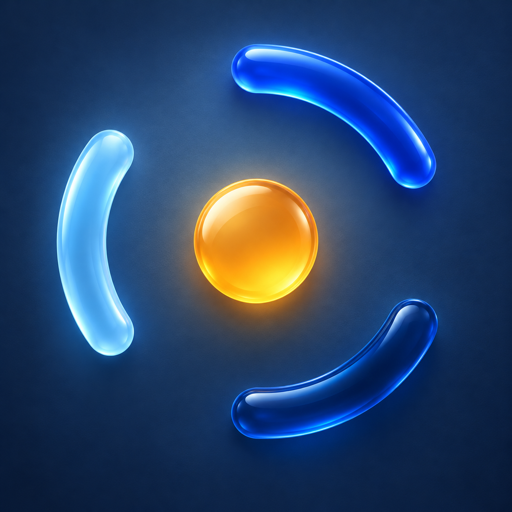

# PersonOS identity

This directory is the canonical source for the PersonOS project mark. The
2049lab organization avatar is a separate laboratory identity.

The mark has one solid center and three equal circular arcs. Every SVG variant
uses the same 64 × 64 geometry: center (32, 32), center radius 8, arc radius
24, stroke width 6, 60-degree sweeps and rotations of 0, 120 and 240 degrees.
The lettering is Inter SemiBold, converted to outlines.

| Asset | Use |
|---|---|
| `mark.svg`, `wordmark.svg` | Primary identity on light backgrounds |
| `mark-dark.svg`, `wordmark-dark.svg` | White identity on dark backgrounds |
| `mark-color.svg` | Optional color variant in product illustrations |
| `presentation.png` | Color presentation artwork for product introductions and avatars |
| `favicon.svg` | Browser icon; adapts to the browser's light/dark preference |
| `icon.svg`, `favicon-180.png`, `favicon-512.png` | White mark on a dark application tile |
| `favicon-16.png`, `favicon-32.png` | Raster fallback on light backgrounds |
| `lockup-tagline*.svg` | Animation end cards |
| `social-preview.*` | Share artwork |

Keep the mark square, leave at least one center radius of clear space around
it, and display it at 16 pixels or larger. Use the explicit light/dark assets;
do not recolor them with CSS filters, stretch them, add shadows, or rotate
individual arcs. The primary wordmark is monochrome.

## Presentation artwork



The presentation image follows the same three-arc silhouette, with blue glass
surfaces and a warm amber center. It adds depth for product introductions and
larger avatars. Use the complete image, including its background, without
stretching or cropping the mark. Navigation, compact UI controls and favicons
continue to use the SVG assets above.

This raster artwork is maintained separately; the rebuild commands below
regenerate the vector assets and their raster exports, not this illustration.

## Rebuild

```bash
uv run --no-project --with 'fonttools[woff]' --with uharfbuzz python docs/assets/brand/build_brand.py
python docs/assets/brand/render_brand.py  # requires rsvg-convert from librsvg
```

Copy the generated SVG files into website/workbench asset directories, keeping
their contents identical. Do not maintain separate drawings in components.
README and animation source already reference this directory. Previously
published video files are historical renders; their end cards only change
when the animation is rendered and published again.

Font license: `../fonts/OFL-Inter.txt`. Project license: Apache-2.0.
